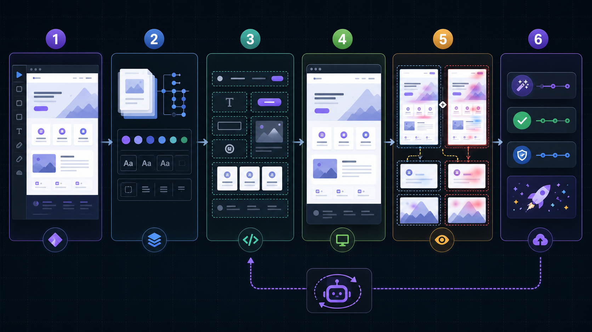
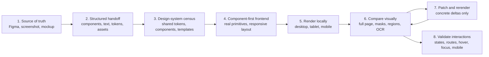

# Design to Frontend Workflow



`design-to-frontend-workflow` is a Codex skill for turning visual UI intent into maintainable frontend code. It is built around a practical loop:

```text
source design -> structured handoff -> component-first implementation -> local render -> visual comparison -> targeted patch -> interaction validation
```

The skill is not a screenshot-to-code shortcut. It is a repeatable engineering workflow for React, Next.js, Tailwind, HTML/CSS, Figma-to-code, screenshot-to-code, image-to-HTML, and design QA tasks where visual fidelity matters but maintainability still matters.

It also does not require near-perfect visual fidelity before development can start. Use generated mockups and screenshots as visual intent, then move quickly into a structured handoff, real component boundaries, data contracts, backend/API work, and vertical slices. Strict pixel targets belong at benchmark, release-polish, or pixel-critical component gates.

## Why This Exists

One-shot screenshot-to-code prompts usually fail in predictable ways:

- They copy pixels instead of building components.
- They overuse absolute positioning.
- They miss icons, hover states, empty states, and responsive behavior.
- They can make a full-page screenshot look close while individual controls are visibly wrong.
- They claim visual parity without rendering, diffing, or checking interactions.

This skill makes the workflow explicit. It asks the agent to inventory the design, build real components, render locally, compare screenshots, patch concrete deltas, and verify interactions before claiming a match.

## What Is Included

- `SKILL.md`: the Codex skill entrypoint.
- `references/paper-methodology-notes.md`: paper-grounded methodology, objectives, rewards, and metric mapping.
- `references/paper-workflow-map.md`: practical mapping from research ideas to this workflow.
- `references/benchmark-fixtures.md`: notes for forward-testing against public benchmark samples.
- `scripts/visual_compare.js`: screenshot rendering, pixel diffing, and optional structured diagnostics.
- `scripts/visual_refine_loop.js`: bounded variant scoring for template-driven visual refinements.
- `scripts/visual_local_search.js`: bounded local search over tunable implementation variables.
- `scripts/visual_ocr_compare.js`: OCR line-box diagnostics for text-heavy screenshots.
- `scripts/visual_ocr_local_search.js`: OCR-aware local search when text wrapping matters.
- `scripts/typography_probe.js`: extracts computed typography from structured references.

## Install

Clone this repository into your Codex skills directory:

```bash
mkdir -p ~/.codex/skills
git clone https://github.com/tefj-fun/design-to-frontend-workflow.git ~/.codex/skills/design-to-frontend-workflow
```

Then reference the skill when working from visual artifacts:

```text
Use $design-to-frontend-workflow to implement this screenshot as frontend code.
```

For scripts, install Node dependencies in the repo:

```bash
cd ~/.codex/skills/design-to-frontend-workflow
npm install
```

OCR diagnostics require a local `tesseract` executable:

```bash
brew install tesseract
```

## Core Workflow



The loop continues until the important mismatches for the active fidelity gate are resolved. For benchmark or release-polish work, the default target is `uiMaskedMismatch < 3%` at the primary viewport. If that target cannot be reached, the agent must document the blocker with evidence.

For product development, that strict target is a release-polish or benchmark gate, not a build-start gate. Backend, API, data modeling, and vertical-slice work can begin once the structured handoff defines the primary flows, entities, states, and data contracts.

## Progressive Fidelity Gates

| Stage | Visual bar | Engineering track |
| --- | --- | --- |
| Concept mockup | Directionally credible; text/assets may be inferred | Explore product direction, workflow, tone, and main surfaces. |
| Structured handoff | Component, text, token, asset, state, and uncertainty inventories exist | Start frontend components, backend/API design, data modeling, and seeded or mocked workflows. |
| Vertical slice | Core flow is coherent; blocked controls, hidden text, and severe overflow are fixed | Build one real end-to-end path with real contracts, state, navigation, and interaction tests. |
| Release polish | Key screens/components meet the agreed visual target, often `uiMaskedMismatch < 3%` | Tighten responsive states, local component regions, accessibility, and production readiness. |

The workflow should keep visual comparison in the loop at each stage, but it should not force backend work to wait for a screenshot-perfect UI. Real data constraints should feed back into the UI while both tracks mature.

## Design-System Census

Before page-focused optimization on a multi-screen app, inspect all provided screens once to extract the shared design system. This is a census, not a full optimization pass.

Capture:

- shared shell and layout: app frame, nav, headers, sidebars, grids, gutters, panels, and breakpoints
- tokens: color roles, typography scale, line heights, spacing, radii, borders, shadows, focus rings, selected/disabled states
- shared components: buttons, inputs, tabs, cards, badges, tables, list rows, filters, modals, empty/loading/error states
- shared icon language: library/source, stroke width, filled versus outline style, semantic roles, icon-label patterns
- page templates: dashboard, list/detail, map/list, wizard/onboarding, settings, analytics, table-heavy, card grid
- asset policy: photos, maps, charts, avatars, generated illustrations, and exact versus representative pixels
- exceptions: similar-looking components that should stay separate because behavior, data, or state differs

Use the census to build or adjust only the stable primitives needed by the active page, vertical slice, or release target. Do not build a complete component library from speculative screenshots. After a shared primitive changes, run a small cross-page regression check on affected pages, then return to the active page lock.

## Page-Focused Refinement

For multi-page apps, the default refinement loop should lock onto one active page, route, state, or flow segment. Do not jump among screens after every scoreboard refresh.

Choose the active target from:

1. The page or flow the user named.
2. The page needed by the current vertical slice or release milestone.
3. The page closest to the active fidelity gate when the goal is to finish one screen.
4. The worst user-visible blocker when the goal is broad triage.
5. A shared component or token pass identified by the design-system census when the same root cause affects multiple pages.

Stay on that target until its fidelity gate is met, it is explicitly blocked, three measured probes fail to improve it, a shared primitive needs a cross-page pass, the user changes priority, or backend/API/state work must happen first. Scoreboard refreshes are diagnostics; they do not reset the active-page lock.

Each page-focused pass should keep a small ledger: active page, fidelity target, baseline/current/best score, top mismatch class, next local region, accepted patches, rejected regressions, and the switch or blocker reason when moving away.

## Source of Truth Ranking

The skill ranks source material in this order:

1. Figma file with metadata, assets, and named layers.
2. Figma frame or structured design spec derived from an image.
3. High-resolution screenshot or generated mockup plus extracted text/assets.
4. Low-resolution image, treated only as rough visual direction.

If the source is only an image, the agent first creates a lightweight handoff:

- Component inventory: screens, panels, cards, controls, tables, modals.
- Text inventory: headings, labels, values, buttons, errors, empty states.
- Token inventory: color, type scale, spacing, radius, borders, shadows.
- Asset inventory: icons, logos, photos, maps, charts, placeholders.
- Responsive targets: desktop, tablet, mobile.
- Known uncertainty: inferred text, hidden states, unavailable assets.

## Manifest-Driven Comparison

The skill uses manifests so the comparison knows what should count and what should not dominate the score.

### Mask Manifest

Image-like regions can dominate pixel diffs even when the UI is structurally correct. The mask manifest marks regions such as:

- photos
- videos
- maps and satellite tiles
- canvas/WebGL
- avatars
- charts
- screenshots inside screenshots
- generated illustrations

The primary score can then exclude those regions while still checking their geometry.

### Icon Manifest

Icons are treated as content, not decoration. The skill asks for an icon manifest with:

- semantic role
- owner component or text
- approximate size
- stroke/fill style
- color
- state
- repeated row/card coverage

Missing, invisible, zero-sized, wrong-library, or weak icons are content mismatches.

### Component-Region Manifest

Full-page scores can hide small but important control errors. The component-region manifest records high-signal regions such as:

- primary buttons
- inputs
- tabs
- nav items
- cards
- table rows
- badges
- icon-label pairs
- modals

For each region, the manifest records the semantic id, owner selector/text, expected bounding box, crop padding, state, and scored contents.

## Metrics

The skill distinguishes global acceptance from local diagnostics.

| Metric | Role |
| --- | --- |
| `uiMaskedMismatch` | Primary acceptance score. Pixel mismatch with approved raster masks excluded. |
| `fullPageMismatch` | Global regression guard. Includes every pixel. |
| `regionMismatch[]` | Per-component visual mismatch for named crops. |
| `regionGeometry[]` | Bounding-box deltas such as `dx`, `dy`, `dw`, `dh`, center delta, and neighbor spacing. |
| `localCropMismatch` | Focused crop mismatch for one component such as a button, input, card row, or icon-label pair. |
| `diagnostics.text.similarity` | Structured text agreement when reference HTML is available. |
| `diagnostics.layout.score` | DOM block position/size agreement when reference HTML is available. |
| `diagnostics.color.score` | Foreground/background color agreement when reference HTML is available. |
| OCR line diagnostics | Rendered text-line agreement for text-heavy screens. |

The important rule: local component comparison supplements full-page comparison. It does not replace it.

## Local Component Comparison

Component-local comparison helps when the macro layout is close but a button, tab, card, or row is still wrong.

Recommended loop:

1. Identify the reference and candidate bounding boxes from source metadata, DOM boxes, or verified screenshot coordinates.
2. Crop both screenshots with enough padding to include shadows, focus rings, labels, and neighbor spacing.
3. Compare content, icon presence, text wrapping, padding, radius, border, shadow, color, and internal alignment.
4. Check `regionGeometry[]` against full-page coordinates.
5. Patch only the component, token, or layout primitive tied to the measured delta.
6. Rerun both full-page and local-region comparison.

Example: a full-page score may barely notice that a button label is 3 px off center. A local crop can catch label centering, icon gap, padding, radius, and focus ring differences. The full-page score still checks that the button did not drift relative to surrounding layout.

## Optional Spark Subagent Patch Pass

The skill supports an optional low-level patch pass with a fast worker model such as `gpt-5.3-codex-spark`.

Use it only after the parent/controller agent has already diagnosed the visual delta. The worker is for bounded mechanical changes, typically 1-2 files:

- button padding
- border radius
- token combinations
- icon gap
- font-size or line-height knobs
- small local alignment changes
- one component's CSS or props

The parent/controller owns:

- visual diagnosis
- prompt construction
- allowed write scope
- diff review
- final acceptance

The worker must receive:

- observed visual delta
- target component or region id
- allowed files and write scope
- allowed tunables
- screenshot or diff artifacts if available
- verification commands
- acceptance criteria

The worker must report:

- changed files
- changed components or tokens
- verification run
- concerns or risks

The parent must review the diff and rerun both full-page and local-region visual comparison before accepting the patch. Do not delegate architecture, broad layout strategy, ambiguous design decisions, or final visual approval to the fast worker.

## Automated Refinement

The scripts are intended for bounded refinement, not unconstrained style generation.

### `visual_compare.js`

Render or compare screenshots and emit pixel diff summaries.

```bash
node scripts/visual_compare.js \
  --reference reference.png \
  --candidate candidate.png \
  --diff diff.png \
  --width 1440 \
  --height 900 \
  --threshold 0.1
```

When a structured reference is available:

```bash
node scripts/visual_compare.js \
  --reference reference.png \
  --candidate candidate.png \
  --diff diff.png \
  --width 1440 \
  --height 900 \
  --reference-html reference.html
```

### `visual_refine_loop.js`

Use template placeholders and a variants JSON file to test plausible changes:

```text
{{mainWidth}}
{{bodyFontSize}}
{{buttonPaddingX}}
{{paragraphMarginBottom}}
```

Accept only variants that improve the targeted metric without degrading text, icon coverage, layout, or global score.

### `visual_local_search.js`

Run a bounded UI2Code^N-style search over known tunables after component structure and content are correct.

Use it for:

- text flow
- vertical rhythm
- component sizing
- image dimensions
- color
- local alignment

Do not let the search invent arbitrary CSS.

### `visual_ocr_compare.js`

Use OCR diagnostics for text-heavy screenshots where DOM boxes are insufficient. It can catch:

- missing reference lines
- changed line wraps
- line-top deltas
- line width/height mismatch

OCR should be used before accepting pixel-only improvements on text-heavy pages.

### `typography_probe.js`

When source HTML exists, probe computed typography:

- `font-family`
- `font-size`
- `font-weight`
- `line-height`
- loaded `document.fonts`

Use the result to build a bounded search space, not as unquestioned truth.

## Paper Grounding

This repository assembles an engineering workflow from published design-to-code and UI-to-code ideas. It does not claim to run the trained models from those papers.

| Paper | Relevant idea | Practical adaptation in this skill |
| --- | --- | --- |
| [Design2Code](https://arxiv.org/abs/2403.03163) | Screenshot-to-code benchmark and rendered screenshot evaluation. | Render local implementation and compare it to the reference. |
| [Figma2Code](https://arxiv.org/abs/2604.13648) | Multimodal use of Figma metadata, assets, and screenshot. | Prefer structured handoff, but translate metadata into maintainable responsive components. |
| [VisRefiner](https://arxiv.org/abs/2602.05998) | Visual-difference-driven refinement with rendered feedback. | Use render, compare, patch, rerender as an operational loop. |
| [UI2Code^N](https://arxiv.org/abs/2511.08195) | Interactive visual optimization and relative candidate ranking. | Use bounded local search and reject regressions. |
| [WebVIA](https://arxiv.org/abs/2511.06251) | Multi-state interaction graph and task-oriented validation. | Validate interactive states, not just the first static screenshot. |
| [LayoutCoder](https://arxiv.org/abs/2506.10376) | Layout relations and layout trees matter for UI generation. | Tune within layout groups instead of arbitrary CSS. |
| [LPIPS](https://arxiv.org/abs/1801.03924) | Learned perceptual similarity can align with human visual similarity. | Optional secondary diagnostic when pixelmatch is too sensitive. |
| [DISTS](https://arxiv.org/abs/2004.07728) | Separates structural and texture similarity. | Optional secondary diagnostic for texture or antialiasing-heavy deltas. |

## Methodology Boundary

Paper-supported:

- Rendered screenshot comparison.
- Structured metadata plus visual input.
- Difference-driven refinement.
- Iterative visual optimization.
- Multi-state interaction validation.
- Text/layout/color diagnostics.

Practical adaptations:

- Pixelmatch-based mismatch scoring.
- Mask manifests for raster regions.
- Component-region crop comparison.
- OCR line-box diagnostics.
- Bounded local search over CSS tokens.
- Spark subagent patch pass for low-level changes.

Not claimed:

- This skill does not run a trained Design2Code, Figma2Code, VisRefiner, UI2Code^N, or WebVIA model.
- This skill does not prove production readiness with a single scalar score.
- This skill does not replace code review, accessibility review, or product judgment.

## Output Report Checklist

When reporting implementation results, include:

- source of truth used
- evidence level: `verified from source`, `inferred from image`, or `not yet checked`
- stack/components touched
- breakpoints checked
- screenshots or diff evidence
- latest `uiMaskedMismatch`
- latest `fullPageMismatch`
- whether `<3%` masked UI target was met
- component-region manifest status
- `regionMismatch[]`, `regionGeometry[]`, or `localCropMismatch` when used
- mask manifest status
- icon manifest status
- subagent patch status
- known mismatches or tradeoffs
- next refinement step

## Example Agent Prompt

```text
Use $design-to-frontend-workflow.

Source of truth:
- reference screenshot: ./reference.png
- target viewport: 1440x900
- implementation route: React + Tailwind

Build a component-first implementation, run local rendering, compare against the screenshot, and iterate until uiMaskedMismatch is below 3% or document the blocker.

Pay special attention to:
- primary CTA button geometry
- card row icon coverage
- mobile overflow
- text line wrapping
```

## Anti-Patterns

Avoid these unless the user explicitly wants a throwaway prototype:

- Convert the full screenshot into one monolithic component.
- Use absolute coordinates for the whole page.
- Omit icons because an exact library icon is unavailable.
- Let maps, photos, or thumbnails dominate the primary UI score.
- Mask text, controls, borders, icons, or layout errors.
- Replace full-page comparison with isolated component crops.
- Ignore responsive behavior after desktop looks close.
- Treat generated image text as reliable.
- Let a fast worker decide visual strategy or final acceptance.
- Claim parity without fresh rendered comparison evidence.

## Repository Status

This is a workflow skill and utility harness, not a framework. The scripts are intentionally small and inspectable so agents can adapt them to the target app without hiding the decision-making behind an opaque optimizer.
